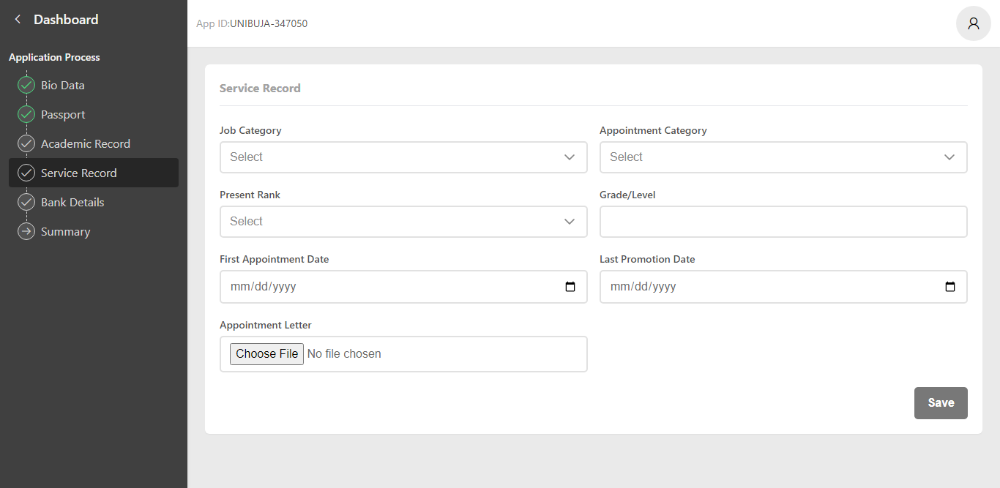

<h1 align="center">Staff Enrollment Management System</h1>

<p align="center"></p>

<h3 align="center">
A hassle-free way for new staff to register and securely store their information, making onboarding a breeze and streamlining administrative tasks. Built for a client in 6 days.
</h3>

<h4 align="center">
<br>
Made with

<a href="https://firebase.google.com/"></a>
<a href="https://vuejs.org/"></a>
<a href="https://javascript.com"></a>
<a href="https://tailwindcss.com/"></a>
<br/>
</h4>
<br>

<h3>
<strong>Links</strong>

<a href="https://staffcms.netlify.app" target="_blank">View the app in action.</a>

<a href="https://www.behance.net/gallery/171897677/Staff-Enrollment-Management-System" target="_blank">Check out more screenshots on behance.</a>
</h3>
<br>

## Project Setup

```sh
npm install
```

### Compile and Hot-Reload for Development

```sh
npm run dev
```

### Compile and Minify for Production

```sh
npm run build
```

### Firebase config
Create a firebase web app from firebase console and paste the app config in source folder (src/composables/firebase.js).
```javascript
import { initializeApp } from 'firebase/app'

const firebaseConfig = {
    //...your firebase config
}

const initFirebase = initializeApp(firebaseConfig)
export default initFirebase
```

## Customize configuration

See [Vite Configuration Reference](https://vitejs.dev/config/).
